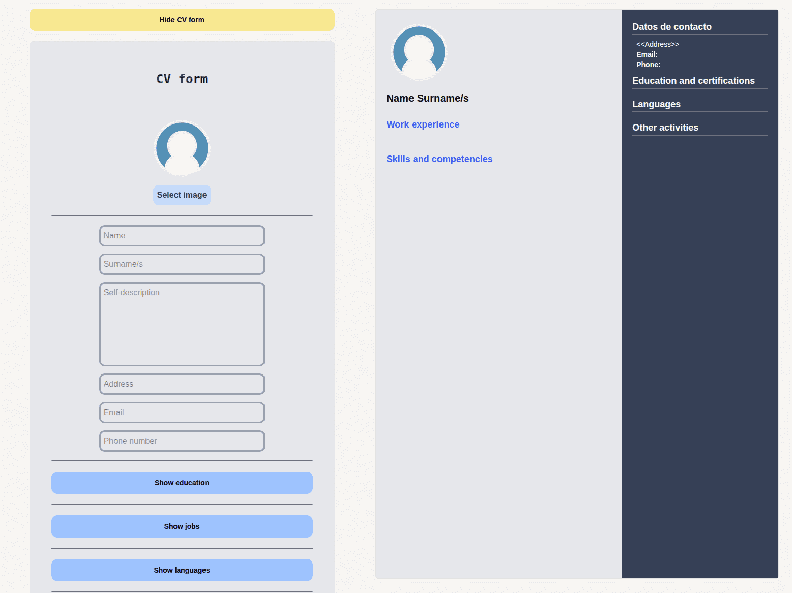
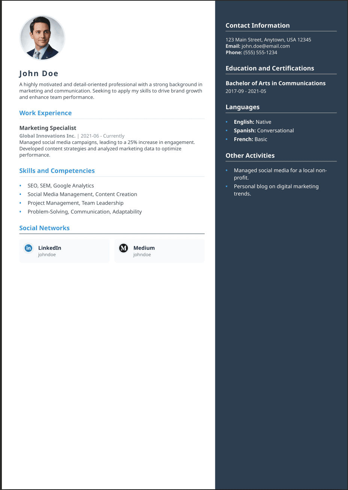
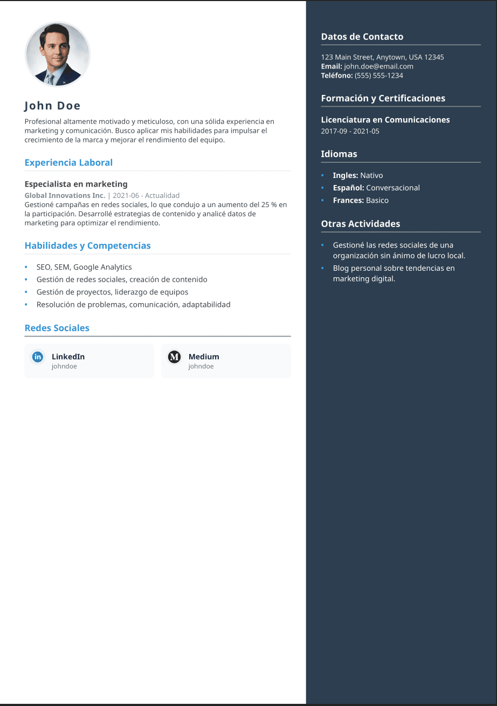

# NextStep CV | By H3rHex

[View in Spanish](#version-en-español)

## Table of Contents
1.  [Preview](#preview)
2.  [Getting Started](#getting-started)
3.  [Technologies](#technologies)
4.  [License and Contribution](#license-and-contribution)


## Preview
### A preview of the NextStep CV application interface

<center>

</center>

### Curriculum Example
<center>

</center>

<center>
  <a href="Examples/cv_example_EN.pdf" style="font-style: italic;">View real PDF</a>
</center>

## Getting Started
This section explains how to get the project up and running.

1.  **Install Python**
   
    * On Linux, it is usually installed by default.
    * For other systems, go to: https://www.python.org/

2.  **Start a virtual environment (optional but recommended)**
    * Linux/Mac
        ```bash
        python3 -m venv venv
        source venv/bin/activate
        ```
    * Windows
        ```cmd
        python -m venv venv
        venv\Scripts\activate.bat
        ```

3.  **Install requirements:**
    
    ```bash
    pip install -r requirements.txt
    ```
4.  **Run the program:**

    * Linux/Mac
        ```bash
        python3 backend/main.py
        ```
    * Windows
        ```cmd
        python backend/main.py
        ```
        
## Technologies
### Frontend
* **TypeScript**
* **React:** Creates the UI
* **Tailwind CSS:** Styles the page 
* **Vite:** Builds the app

### Backend
* **Python**
* **Flask:** Manages backend logic and HTML templates
* **WeasyPrint:** The PDF creation engine

## License and Contribution

This project is distributed under the **GNU General Public License v3.0**. You are free to modify and use the code.

<a id="version-en-español"></a>
---

# NextStep CV | By H3rHex

[Ver en inglés](#)

## Tabla de Contenidos
1.  [Vista Previa](#preview-es)
2.  [Primeros Pasos](#primeros-pasos)
3.  [Tecnologías](#tecnologias)
4.  [Licencia y Colaboración](#licencia-y-colaboracion)


<a id="preview-es"></a>
## Vista Previa
### Una vista previa de la interfaz de la aplicación NextStep CV

<center>

</center>

### Ejemplo de Currículum
<center>

</center>

<center>
  <a href="Examples/cv_example_ES.pdf" style="font-style: italic;">Ver PDF real</a>
</center>

<a id="primeros-pasos"></a>
## Primeros Pasos
Esta sección explica cómo configurar y ejecutar el proyecto.

1.  **Instalar Python**
   
    * En Linux, suele estar instalado por defecto.
    * Para otros sistemas, visita: https://www.python.org/

2.  **Iniciar un entorno virtual (opcional pero recomendado)**
    * Linux/Mac
        ```bash
        python3 -m venv venv
        source venv/bin/activate
        ```
    * Windows
        ```cmd
        python -m venv venv
        venv\Scripts\activate.bat
        ```

3.  **Instalar dependencias:**
    
    ```bash
    pip install -r requirements.txt
    ```
4.  **Ejecutar el programa:**

    * Linux/Mac
        ```bash
        python3 backend/main.py
        ```
    * Windows
        ```cmd
        python backend/main.py
        ```
        
<a id="tecnologias"></a>
## Tecnologías
### Frontend
* **TypeScript**
* **React:** Crea la interfaz de usuario
* **Tailwind CSS:** Da estilo a la página 
* **Vite:** Compila la aplicación

### Backend
* **Python**
* **Flask:** Gestiona la lógica del backend y las plantillas HTML
* **WeasyPrint:** El motor de creación de PDF

<a id="licencia-y-colaboracion"></a>
## Licencia y Colaboración

Este proyecto se distribuye bajo la licencia **GNU General Public License v3.0**. Eres libre de modificar y usar el código.